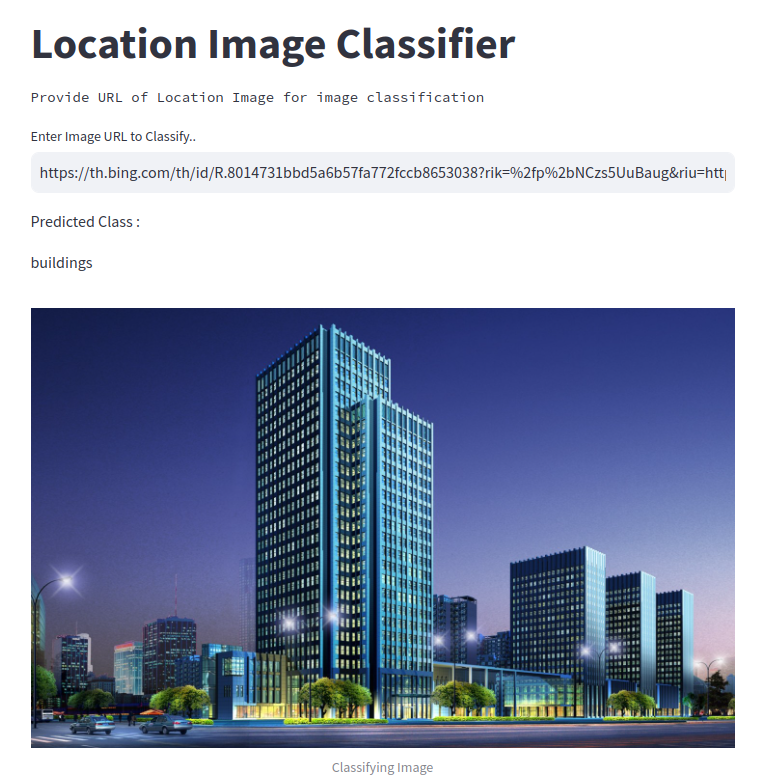

# MLOps-K8s

## Project Overview : Building or Mountain ?

Who has never asked himself the question, building or mountain ? I am here for you. In this project totally align with any business need I built a model to help you answer this fundamental question and then latter deploy it through a streamlit application.

This application will surely suffer from its success, so to prevent unwanted slowdown we need to make sure to implement a load balanced architecture with kubernetes hosted on GKE.

## Built with

- [](https://www.tensorflow.org/)
- [](https://www.docker.com/)
- [](https://kubernetes.io/fr/)
- [](https://cloud.google.com/kubernetes-engine/)
- [](https://github.com/)
- [](https://streamlit.io/)

## Data source

The dataset used in this project is intel image classification from Kaggle. You can found it [here](https://www.kaggle.com/datasets/puneet6060/intel-image-classification). 


This Dataset contains around 25k images of size 150x150 distributed under 6 categories.
{'buildings' -> 0,
'forest' -> 1,
'glacier' -> 2,
'mountain' -> 3,
'sea' -> 4,
'street' -> 5 }

## Streamlit webapp


## Setup 
- Run the model_train.ipynb notebook in Google Colab. (Optional)
- Store the model weights in the /models folder. (Optional)
- Indicate your GCP project in the deployment.yaml for Kubernetes.
- Ensure you have the APIs activated and the right permissions for your cloud role.
- Launch the Kubernetes cluster from the Google Cloud Shell using the command: 
```bash
gcloud container clusters create mykube --zone "your-region" --machine-type "your-machine-type" --num-nodes "1" --service-account your-service-account@appspot.gserviceaccount.com
```
- Store your project_id and service account key in GitHub secrets.
- Push your code to your remote repository.

Now the application should be automatically deployed to your GKE instance. Go to Kubernetes services and check the newly created endpoint."


## Improvement
- Store the models weights and access it through google cloud storage.
- Implement testing and monitoring.
- Experiment tracking with W&B.

